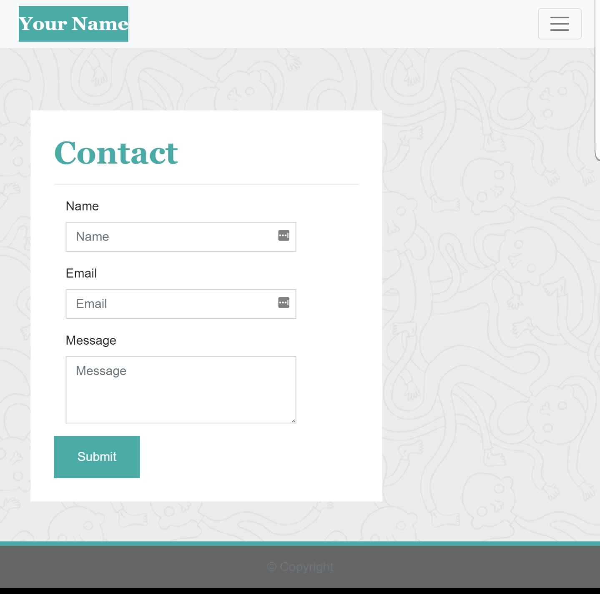

# Responsive Portfolio.
View the [project-page](https://github.com/Mgithub89/HW2-ResponsivePortfolio)

View the [deployed-app](https://mgithub89.github.io/Responsive_Portfolio/)

## Table of contents
   * About The project
   * Minimum Requirements
   * Sample-ScreenShot Image
   * HTML
   * CSS
   * Built With
   * Contact

### About The Project
---
   The objective of this project is creating a responsive portfolio site that contain there pages(About, Contact and Portfolio) with a responsive navbar contain links to each pages of the website, a responsive layout and responsive images that works well on variety of devices or screen sizes by using **Bootstrap Components** and Bootstrap grid system based on the given three different screen shoot portfolio pages on different screen size and based on the given minimum requirements about this project. 

###  Minimum Requirements

* Functional, deployed application

* GitHub repository with README describing the project

* Navbar must be consistent on each page.

* Navbar on each page must contain links to Home/About, Contact, and Portfolio pages.

* All links must work.

* Must use semantic html.

* Each page must have valid and correct HTML. (use a validation service)

* Must contain your personalized information. (bio, name, images, links to social media, etc.)

* Must properly utilize Bootstrap components and grid system.

### Sample-ScreenShot Image

### HTML
* **index.html** - for About/Home page.
* **contact.html** - for Contact page.
* **portfolio.html** - for a web responsive collection of images page.
* Each portfolio page given a concise and descriptive title, and also each page contain a responsive navbar and a footer with links to social media.
* **Semantic HTML** elements like header, main, section, figure, form used for a better web page accessiblity.
* Each portfolio page HTML validated by [W3C Markup Validation Service](https://validator.w3.org/).

### CSS
 External css(style.css) used to change the style and layout of the pages like :
   * **background-image** - for body.
   * **box-shadow** - for footer.
   * **font-family** - for h1 and navbar elements.
   * **hight and width** - for all images.
   * **max-width** - for portfolio page and about page.

 ### Built With
 * HTML
 * CSS
 * Bootstrap components and Grid system.
 * Font-awesome.

 ### Contact
 Metages Worku - [metages09@gmail.com](mailto:metages09@gmail.com)

