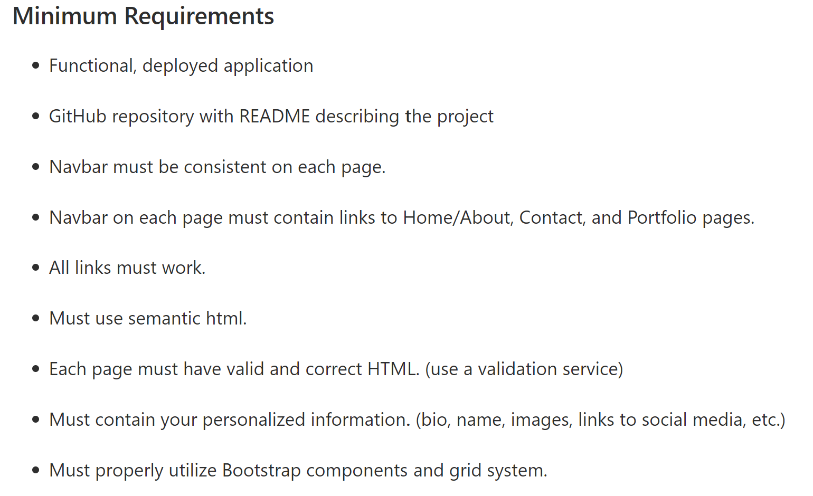

# Responsive Portfolio.
View the [project-page](https://github.com/Mgithub89/HW2-ResponsivePortfolio)

View the [deployed-app](https://mgithub89.github.io/HW2-ResponsivePortfolio/)
## About The Project
---
   *The objective of this project is creating a responsive portfolio that works well on variety of devices or screen sizes by using _Bootstrap css framework_ and grid system based on the given three different screen shoot portfolio pages on different screen size and based on the given minimum requirements about this project. 

###  Minimum Requirements

* Functional, deployed application

* GitHub repository with README describing the project

* Navbar must be consistent on each page.

* Navbar on each page must contain links to Home/About, Contact, and Portfolio pages.

* All links must work.

* Must use semantic html.

* Each page must have valid and correct HTML. (use a validation service)

* Must contain your personalized information. (bio, name, images, links to social media, etc.)

* Must properly utilize Bootstrap components and grid system.

## HTML
* Each page given a concise and descriptive title.
* **Semantic HTML** elements like header, main, section, figure used for a better web page accessiblity.
* Each portfolio page HTML validated by [W3C Markup Validation Service](https://validator.w3.org/).

## CSS
 External css(style.css) used to to change the style and layout of the pages like :
   * **background-image** for body.
   * **box-shadow** for footer.
   * **font-family** for h1 and navbar-brand.
   * **hight and width** for all images.
   * **max-width** for portfolio page and about page.

 ## Built With
 * Bootstrap components and grid system.
 * Font-awesome.

 ## Contact
 Metages Worku -

